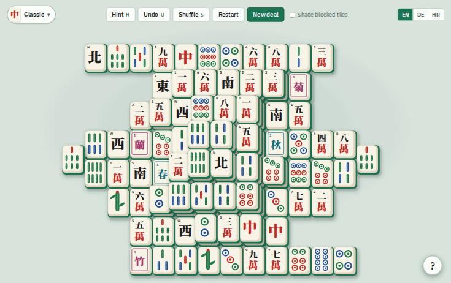

# Turtle Mahjong

**[▶ Play it here](https://ivankovic.github.io/mahjong/)**



Mahjong solitaire on the classic 144-tile turtle layout, in the browser, in
English, German and Croatian.

It comes with eight tile styles: Classic, and seven for kids: Dog Park,
Cat Corner, Chameleon Jungle, Coral Reef, Enchanted Land, Mountain Trail and
Haunted Night. Pick one from the button at
the top left; the language switch is at the top right. The kids' styles keep the
structure of a real set. There are three suits of 1 to 9 pictures to count,
each tile with its number at the top. There are seven single pictures in
place of the winds and dragons, and two groups of four in place of the
flowers and seasons, where any tile matches any other tile in its group.

Each style also clears a pair its own way. Dogs hop off in a burst of paw
prints and bones. Chameleon tiles change colour and fade, with leaves and
ladybirds falling. Reef tiles float up among bubbles. Haunted tiles turn to
ghosts and let out bats. Cats pounce away, enchanted tiles twirl off in a
puff of magic, and on the mountain a gust of wind carries them off.

Clearing the whole board starts a celebration in the same style: lanterns
and sparks, leaping dogs under a rain of bones, leaping chameleons and
butterflies, fish and a whale swimming past, or a swarm of bats.

Most deals have one surprise, picked from the deal number, so a restart
brings the same one back. Two tiles may glow (match one and PAIR UP clears
every pair that is open at that moment), a helper may come and take a pair for you, or a bit of
mischief may cover a few tiles until they are tapped. The ? button in the
corner of the board explains the rules with the current style's tiles.

Pick two free tiles with the same face to clear them. A tile is free when
nothing rests on it and its left or right side is open. Any flower matches
any flower, and any season matches any season.

Every deal can be cleared. The game deals by playing the board backwards
from full: each pair goes on two tiles that are free at the same moment, so
removing the pairs in reverse order always works. Shuffle uses the same
method on the tiles that are left.

## Controls

| Key            | Action                                      |
| -------------- | ------------------------------------------- |
| H              | Show a matching pair (press again for another) |
| U, Ctrl+Z      | Undo the last pair or shuffle               |
| S              | Shuffle the remaining tiles                 |
| Esc            | Clear the selection                         |
| ?              | How to play                                 |

The current game, your best time and the "shade blocked tiles" setting are
kept in the browser's local storage.

## Running it locally

There is no build. The page fetches `assets/tiles.svg`, so serve the folder
instead of opening `index.html` as a file:

```sh
python3 -m http.server
```

Then open <http://localhost:8000/>.

## Layout

- `index.html`: the page
- `src/game.js`: layout, dealing, rules and the board
- `src/style.css`: the table and the tiles' bodies
- `src/i18n.js`: every word the game shows, in each language (German uses
  Swiss spelling, "ss" for "ß")
- `assets/themes/<style>.svg`: each style's 42 tile faces, one `<symbol>` each
- `assets/themes/themes.json`: the styles, and the names of their tiles
- `assets/src/build.mjs`: draws all of the above

The sprites are generated. To change a picture, edit `assets/src/build.mjs`
and run `node assets/src/build.mjs`, then commit both. The page's colours,
fonts, tile bodies and clearing animations for each style are the
`[data-skin]` blocks in `src/style.css`; the pictures that fly off a cleared
tile are the `<style>-fx-*` symbols, and `FX` in `src/game.js` says how they move.

## The GIF above

`docs/themes.gif` is made by `tools/demo-gif.mjs`, which opens the game from
the working tree in a headless browser, deals the same game every time,
photographs it in each style and crossfades between them. After changing a
style, make it again:

```sh
npm install
npx playwright install chromium   # once
npm run demo-gif
```

The game itself needs none of this; `package.json` is for this tool only.

## Deployment

`.github/workflows/pages.yml` publishes the site to GitHub Pages on every
push to `main`. In the repository's Settings → Pages, the source must be
"GitHub Actions".

## License

- Code: [AGPL-3.0-or-later](LICENSE).
- Art (`assets/`, including `assets/src/build.mjs`, which is the source of the drawings): [CC-BY-NC-ND-4.0](LICENSES/CC-BY-NC-ND-4.0.txt).

See [`REUSE.toml`](REUSE.toml) for the per-path license mapping.
